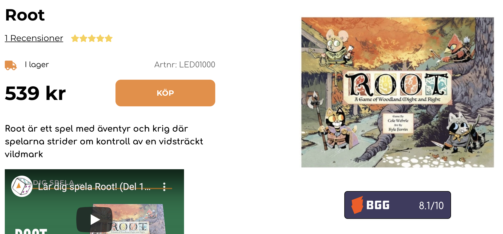

# bgg-extension  

Adds BoardGameGeek rating to some webshops

> ❗ Matching games is far from perfect. Would probably need a better search engine than what BGG provides.

  
Screenshots

## Support

Currently the following sites are supported:

- [alphaspel.se](https://alphaspel.se/search/?query=root)
- [spelexperten.com](https://www.spelexperten.com/cgi-bin/ibutik/AIR_ibutik.fcgi?funk=gor_sokning&AvanceradSokning=N&artnr=&varum=&artgrp=&Sprak_Suffix=SV&term=root)
- [tabletopfinder.eu](https://www.tabletopfinder.eu/en/category/board-game)
- [worldofboardgames.com](https://www.worldofboardgames.com/webshop-sok.php?searchString=root&search=S%F6k)

> ❗ Feel free to add more sites in `/src/config`.

## Installation

### Firefox 🚤

1. Go to https://github.com/benjick/bgg-extension/releases
2. Click on the `bgg_extension-XXX-an+fx.xpi` file
3. Click "Continue to Installation" in the popup followed by "Add"

### Chrome 🚣

1. Go to https://github.com/benjick/bgg-extension/releases
2. Download the `bgg-extension-XXX.zip` file and unpack it
3. Point your browser to `chrome://extensions/`
4. Check "Developer mode" in the top-right corner, then "Load unpacked" and nagivate to your unpacked folder

## Development

1. Install dependecies: `yarn`
2. Start file-watcher and launch firefox: `yarn dev`
3. You can also launch chrome/chromium with `yarn chromium`

> ❗ To be able to run chrome/chromium you probably will have to `cp .env.example .env` and adjust the `CHROME_PATH` variable.
